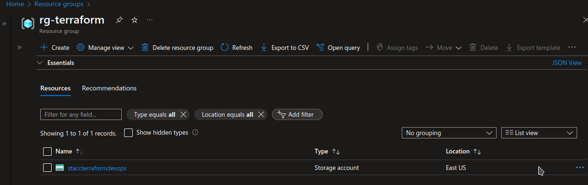
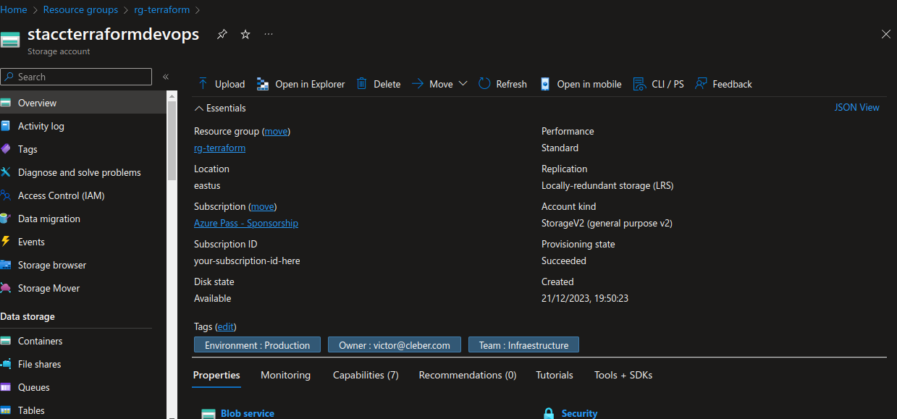
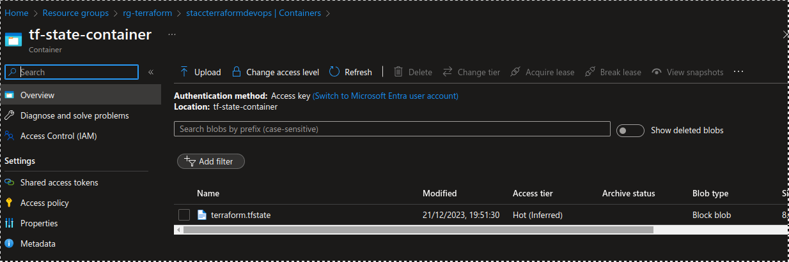
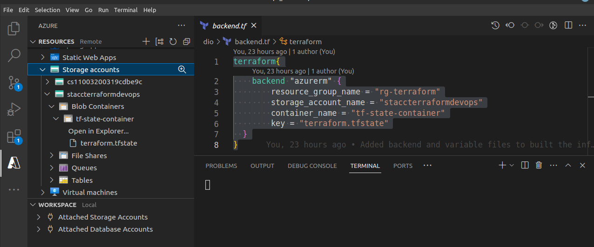
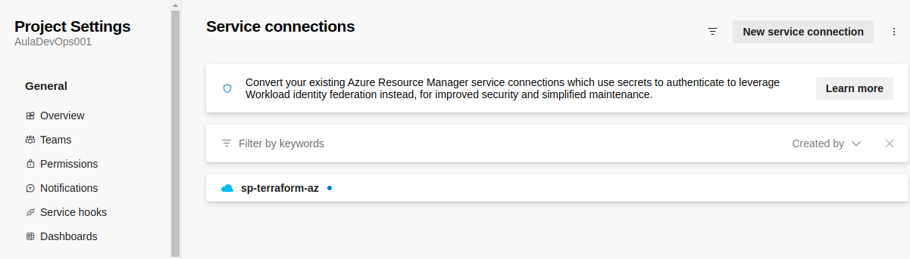
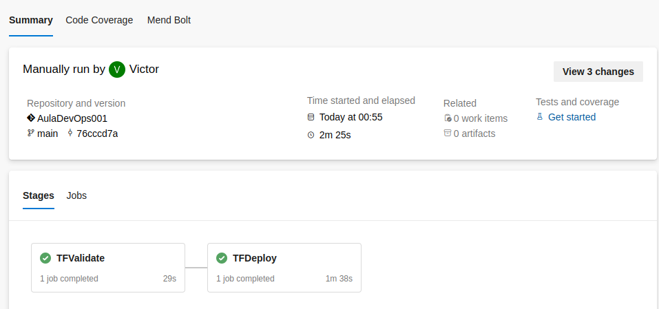
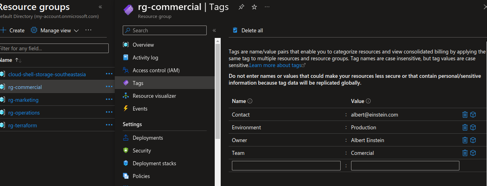
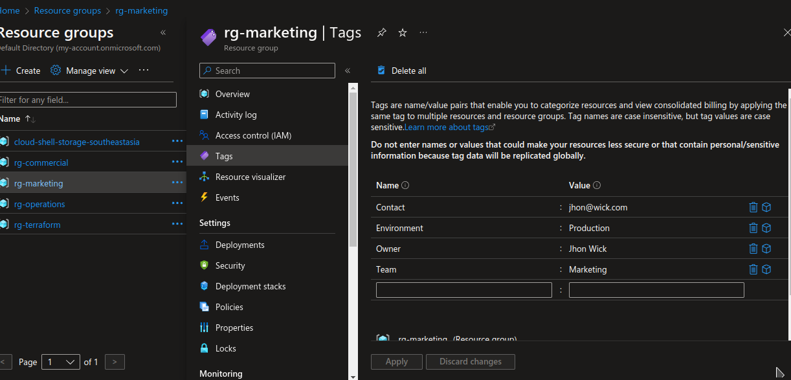
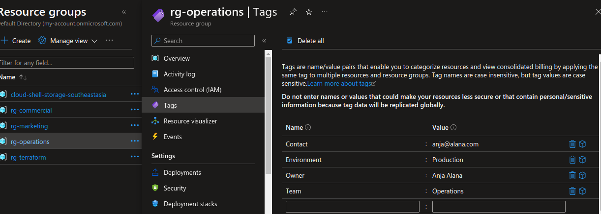

# DIO BOOTCAMP
In this project, we will create the infrastructure using Terraform.

## Pre-requirements

- install terraform
- install azurecli
- create an Azure account
- Create an Azure DevOps account

### Step 1: Authenticate your command line
```bash
   az login
```
    
### Step 2 : Create a Resource Group



### Step 3: Create a storage account and a container  for your terraform state







### Step 4: Create a service principal
```powershell
    subscriptionName=$(az account show --query name --output tsv)
    subscriptionId=$(az account show --query id --output tsv)
    echo $subscriptionName
    echo $subscriptionId
    az ad sp create-for-rbac --name sp-terraform-az --role contributor --scopes /subscriptions/$subscriptionId
```





### Step 5 : Create an AzureDevops project
``` 
    project              : AulaDevOps001
    service connection   : sp-terraform-az
```


### Step 6 : Create resource groups using a pipeline


</br>
</br>

</br>
</br>


</br>
</br>

